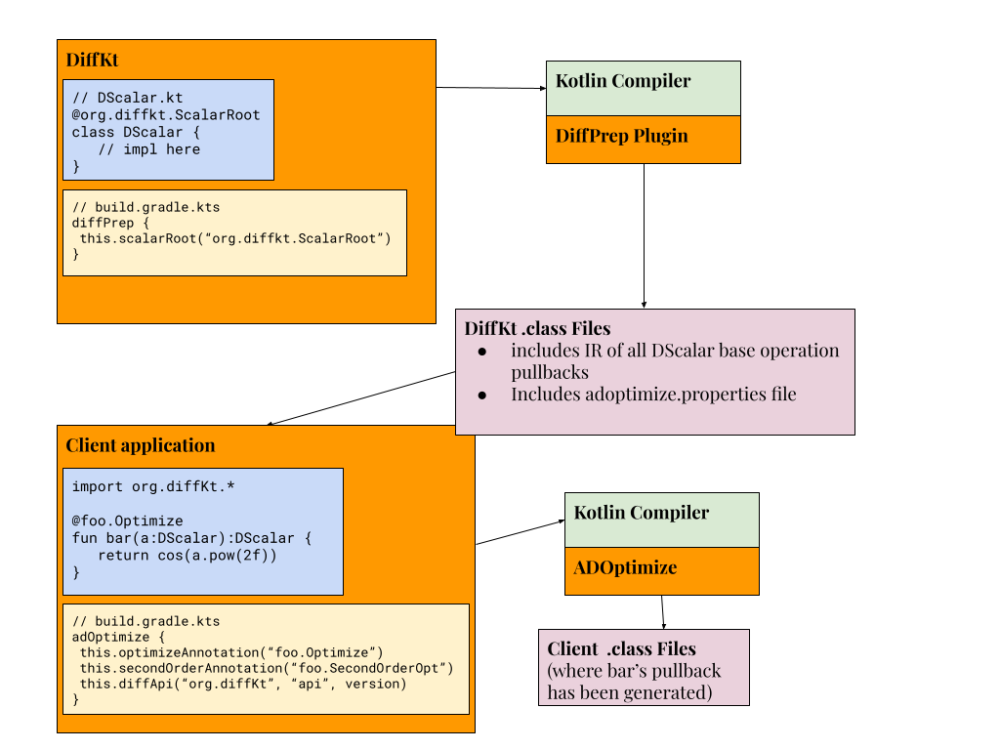

# AdOptimize Kotlin Plugin

AdOptimize is a Kotlin compiler plugin that can transform functions written using an operation overload automatic differentiation library (OO AD) into a function over Kotlin Floats that returns the derivatives and primal value (SCT AD). It also includes a proof of concept feature that transforms functions over Kotlin floats into a function that returns the derivative. 

AdOptimize is not recommended for use in production; it is a research project. AdOptimize is unique in that the functions it produced may interoperate with functions written using the library.

AdOptimize is also a proof of concept of the IR-serialize feature of the Kotlin compiler. When this feature is enabled, the Kotlin IR is serialized into the class files of a compiled JVM program, where it can be extracted by the compiler during the compilation of a consuming module. The benefit of this feature is that it enables a view of the entire program, which is a requirement for many optimizations including inlined derivative code.

### Features:
- Removes the object wrapping that OO AD depends on via performing the differentiation via source code transformation. This is supported for reverse mode and a combination of forward and reverse mode (a variation of second order) over scalar functions. Only one active parameter is supported. (see `adOptimizeClient/src/main/kotlin/client/main.kt` for an example. The function `target` over DScalars is an example of this unwrapping. The annotation `@SecondOrderOptimize` and `@Optimize` indicate that both the first and second order derivatives shall be generated by AdOptimize)
- single parameter reverse mode differentiation for Kotlin Floats (see `adOptimizeClient/src/main/kotlin/client/main.kt` for an example. The function `target` over Floats is an example of this prototype)
- control flow

### From Source Usage
- download or clone repository
- publish the api locally using the gradle command `publishLocal`
- Create a client project. Depend on DiffKt and create an ADConfig file that matches that of `adOptimizeClient/src/main/kotlin/AdConfig.kt`. The annotations can have custom names but if you change them you must also change them in the build script in the following step.
- clone the gradle build from `adOptimizeClient/build.gradle`
- Write a function using the @Optimize annotation and test the performance differences. See `adOptimizeClient/src/main/kotlin/client/main.kt` for an example.

### Testing
- To run the AdOptimize and DiffPrep IR and codegen tests, run `./gradlew integrationTests`.
- IR tests are programs that accept a text file of source code and a text file of expected serialized IR and verify that the source code, when compiled to Kotlin IR and serialized, matches the expected serialized IR file. These tests are useful during development to verify stubs have been generated correctly. It's common to produce the expectation file by coding up what you expect the compiler to generate by hand and serializing the hand written file. Note that if you delete the expectation file the test framework will generate a default one based on the source file and fail the test.
- Codegen tests are programs that accept a text file of source code, where the source code contains a `box()` method. The test fails if the box method does not return "OK". Codegen tests are the primary form of testing in the compiler environment.

### Components
**differentiable-api-preprocessor**
The differentiable-api-preprocessor plugin (DiffPrep) is used in the compilation of the operation overloading library. The tests in AdOptimize rely on the operation overloading AD library DiffKt but there is no reason another implementation cannot be used. The OO AD library annotates key components of the library such as the differentiable scalar type and binds the fully qualified name of the annotation to a key defined in DiffPrep. DiffPrep will produce a configuration file for AdOptimize to consume during a client application's compilation.

**producer-consumer**
The Producer Consumer is an independent top level project that demonstrates the usage of a client application that uses AdOptimize but relies on a custom OO AD library. This is a good demonstration of the build script configration.

**adOptimize**
AdOptimize contains the AD generation code. The work flow is Kotlin IR is translated into DiffIR, a subset of Kotlin IR wrapped in classes that store pullback and active information for each statement. There are reverse and forward mode passes that accept DiffIR and return differentiated Kotlin IR. The intention was for the IR returned by each pass to be eligible for transformation back into Diff IR so that multiple differentiation passes could be applied, therefore supporting arbitrary orders of differentiation and combinations of reverse and forward. Only the Reverse-Forward combination was ever tested.

**plugin-generators-common**
In order to map to DiffIR, the Kotlin code must be lowered. A lowered language makes code generation easier because it reduces the number of constructs that must be supported. For example, we unnest all expressions so that every operation has a variable. The lowering in this module are used by both DiffPrep and AdOptimize. This module also includes extensions of Kotlin Compiler types so that functions and classes generated by the plugin are visible to consuming projects. See GeneratedAuthenticClassDescriptor.kt and ClassLifter.kt for details.

**adOptimizeClient**
The adOptimize client is an independent top level project that demonstrates how to use AdOptimize with DiffKt.

Below is an illustration of the relationship between a client application, DiffPrep, and AdOptimize.


### Code Generation Example
What does AdOptimize generate? Let us suppose we are given the following code:
```kotlin
@Optimize
fun target(a:DScalar, L:Int):DScalar {
    var i = 0
    var s = a*a
    while(i<L) {
        s = s * (s + a)
        i = i + 1
    }
    return s
}
```
AdOptimize will generate a class `ReverseScalar` that contains an implementation of the pullback of the function defined above. It will look something like this:
```kotlin
fun target(a:DScalar, L:Int):DScalar {
    class target_Reverse(val a:ReverseScalar, val L:Int): ReverseScalar(FloatScalar.ZERO, a.derivativeID) {
        override val primal: DScalar
        val decisions = CodeGenStack<Any>()
        val intermediateValues = CodeGenStack<Any>()
        init {
            val a_primal = this.a.basePrimal().value
            val L = this.L
            var i = 0
            var s = a_primal * a_primal
            while(i<L) {
                intermediateValues.push(s)
                val intermediate_variable_0 = s + a_primal
                intermediateValues.push(s)
                intermediateValues.push(intermediate_variable_0)
                val intermediate_variable_1 = s * intermediate_variable_0
                s = intermediate_variable_1
                val intermediate_variable_2 = 1
                val intermediate_variable_3 = intermediate_variable_2 + i
                i = intermediate_variable_3
                decisions.push(-1)
            }
            this.primal = FloatScalar(s)
        }

        override fun backpropagate() {
            val a_local_0 = this.a
            val a_local_1_primal:Float = a_local_0.basePrimal().value
            var a_derivative_2 = 0f
            val L_local_3 = this.L
            val s_local_4 = this.primal
            // Note that in reality this is checked to make sure upstream is a DScalar and not a DTensor to support multiple outputs. Here I removed that check to simplify the code generation demo
            var upstream = (this.upstream as DScalar).basePrimal().value
            while(this.decisions.notEmpty() && this.decisions.top() == -1){
                this.decisions.pop()
                var intermediate_variable_1_derivative_6 = 0f
                var intermediate_variable_0_derivative_8 = 0f

                intermediate_variable_1_derivative_6 = upstream
                upstream = 0f

                val intermediate_variable_0_local_9 = intermediateValues.pop() as Float
                val s_local_10 = intermediateValues.pop() as Float
                val up0 = intermediate_variable_1_derivative_6
                val l = up0 * intermediate_variable_0_local_9
                val r = up0 * s_local_10
                upstream = upstream + l
                intermediate_variable_0_derivative_8 = intermediate_variable_0_derivative_8 + r

                val s_local_11 = intermediateValues.pop() as Float
                val up = intermediate_variable_0_derivative_8
                upstream = upstream + up
                a_derivative_2 = a_derivative_2 + up
            }
            val l = a_local_1_primal * upstream
            a_derivative_2 = a_derivative_2 + l + l
            this.a.pushback(FloatScalar(a_derivative_2))
        }
    }
    return when(a){
        is ReverseScalar -> target_Reverse(a, L)
        else -> {
            var i = 0
            var s = a*a
            while(i<L) {
                s = s * (s + a)
                i = i + 1
            }
            s
        }
    }
}
```
Note that the primal function is also transformed in order to only return the optimized code under certain conditions. 

## License
AdOptimize is MIT licensed, as found in the [LICENSE](LICENSE) file.